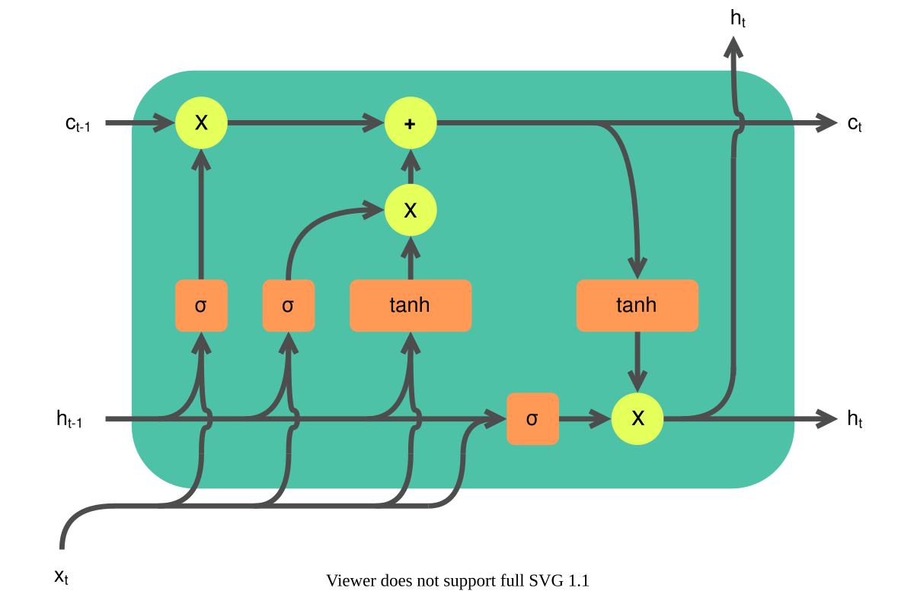
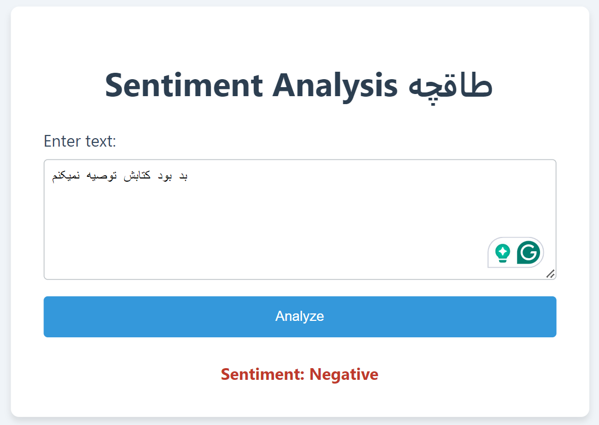

# Taaghche-Sentiment-Analysis

This project implements a sentiment analysis model for Persian book reviews using PyTorch and the HuggingFace Transformers library. The model is trained on a dataset of book reviews from Taghche, a Persian e-book platform.
I added implemented a 🐋 dockerfile for building a image.



## Table of Contents
- [Taaghche-Sentiment-Analysis](#taaghche-sentiment-analysis)
  - [Table of Contents](#table-of-contents)
  - [Overview](#overview)
  - [Requirements](#requirements)
  - [Dataset](#dataset)
  - [Preprocessing](#preprocessing)
  - [Model Architecture](#model-architecture)
  - [Data Flow](#data-flow)
  - [Training](#training)
  - [Results](#results)
  - [Usage](#usage)
  - [🐋 Docker Setup Guide for Taaghche Sentiment Analysis](#-docker-setup-guide-for-taaghche-sentiment-analysis)
    - [1. Building the Docker Image](#1-building-the-docker-image)
  - [Acknowledgments](#acknowledgments)

## Overview

This project aims to classify Persian book reviews into positive and negative sentiments. It uses a bidirectional LSTM model with an embedding layer and fully connected layers for classification. The model is trained on a balanced dataset of book reviews, where the sentiment is derived from the rating (1-5 stars) associated with each review.

I used the **HooshvareLab/bert-base-parsbert-uncased** tokenizer from Hugging Face's transformers library to tokenize and encode the Persian text into numeric representations that can be fed into the model.

## Requirements

- **Hazm** (for Persian text processing)
- **Transformers** (HuggingFace)
- PyTorch
- Scikit-learn
- tqdm

You can install the required packages using pip:

## Dataset

The dataset used in this project is a CSV file named 'taghche.csv', containing Persian book reviews. Each review includes the following information:
- Comment text
- Rating (1-5 stars)
- Date
- Book name
- Book ID
- Number of likes

|    Id | date       | comment                                                                                                                                                                                                                         | bookname           | rate | bookID | like |
| ----: | :--------- | :------------------------------------------------------------------------------------------------------------------------------------------------------------------------------------------------------------------------------ | :----------------- | ---: | -----: | ---: |
| 69824 | 1398/06/13 | من چاپیش رو خوندم خیلی هم لذت بردم.به نظرم موضوعش تکراری نبود و از این لوس بازیهای. رمانی نداشت.هر چند مرگ دخترش خیلی تلخ بود اما در کل عالی بود.کاش نشر سخن نویسنده های خوبش رو بیشتر معرفی می کرد تا مردم هم بیشتر آشنا بشن . | رو به باد          |    5 |  59636 |    3 |
| 69825 | 1398/06/16 | کاش یه تخفیف میذاشتن . خیلی دوست دارم بخونمش                                                                                                                                                                                    | تحقیر و توهین‌شده‌ها |    5 |  59638 |    2 |
| 69826 | 1398/05/26 | این کتاب داستان درد و رنج کشاورزان بیکارشده‌ی آمریکا به‌دنبال رشد صنعتی است، که هم‌داستانِ تمام مردمان فقیر و طردشده از جامعه هستند.                                                                                                | خوشه‌های خشم        |    5 |  59645 |    9 |
|       |            | داستان هم سورپرایز خاصی نداره، فقر و فلاکت داستان جدیدی نیست، اما این دفعه با قلم هنرمندانه‌ی جان استاین‌بکه، که ارزش خوندن داره.                                                                                                 |                    |      |        |      |
| 69827 | 1398/09/29 | کتابی فوق العاده زیبا و عالی                                                                                                                                                                                                    | موش‌ها و آدم‌ها      |    5 |  59646 |    0 |
| 69828 | 1398/07/24 | یکی از بهترین و تلخ ترین رمان های عمرم!واقعا درداور و درعین حال بی نظیر بود.البته من صوتیشو گوش دادم.شاید داستان ادم هایی باشه که کودک درونشون رو با دستای خودشون می کشن...                                                     | موش‌ها و آدم‌ها      |    5 |  59646 |    4 |

The dataset is preprocessed and balanced to ensure an equal distribution of positive and negative sentiments.

## Preprocessing

The preprocessing pipeline is implemented in multiple functions that clean and normalize the text data. Key steps include:

- Stopword Removal: I gathered 4 files of Persian stopwords that Filters them out from the text.
- Normalization: Applies character and affix spacing, Lemmatization and Stemming using **Hazm**
- Emoji, Links, and Special Character Removal: Cleans the text from non-informative elements such as emojis, links, and other special characters.

## Model Architecture

The model used is a Bidirectional LSTM-based Recurrent Neural Network (RNN) implemented in PyTorch. It processes tokenized sequences and applies multiple layers, including an embedding layer, LSTM, fully connected layers, and a final sigmoid activation to predict the sentiment.

1. **Embedding Layer**: Converts input tokens to dense vectors.

2. **Bidirectional LSTM**: Processes sequences, capturing context from both directions.

3. **Feature Extraction**: Concatenates final hidden states from both LSTM directions.

4. **Classification Head**:
   - First fully connected layer
   - Batch normalization
   - GELU activation
   - Second fully connected layer
   - Sigmoid activation

## Data Flow

1. Input → Embedding → Bidirectional LSTM
2. LSTM output → Concatenation → FC layers
3. FC output → Batch Norm → GELU → FC → Sigmoid
4. Final output: Single probability value (0-1)

This architecture efficiently handles variable-length sequences and is suitable for tasks like sentiment analysis or text classification.

## Training

The model is trained using:
- AdamW optimizer
- Binary Cross-Entropy loss
- ReduceLROnPlateau learning rate scheduler
- Batch size of 256
- Training for 100 epochs (or until convergence)

## Results

The final model achieves a test accuracy of **86.74%** on the held-out test set.

## Usage

To use this model for sentiment analysis:

1. Prepare your data in a similar format to the original dataset.
2. Run the preprocessing steps on your data.
3. Load the trained model:

```python
model = RNN(vocab_size, num_embd, rnn_hidden, fcl_hidden)
model.load_state_dict(torch.load('model_taghche.pth'))
model.eval()
```

4. Use the model to predict sentiment:

```python
def predict_sentiment(text):
    encoded = tokenizer.encode(text)
    input_tensor = torch.tensor(encoded).unsqueeze(0).to(device)
    lengths = torch.tensor([len(encoded)]).to(device)
    with torch.no_grad():
        output = model(input_tensor, lengths)
    return "Positive" if output.item() > 0.5 else "Negative"

sentiment = predict_sentiment("کتاب بسیار بدی بود. اه اه")
print(f"Predicted sentiment: {sentiment}")
```

| Original Comment                                             | Preprocessed Comment                                   | Sentiment |
| ------------------------------------------------------------ | ------------------------------------------------------ | --------- |
| کتاب بسیار بدی بود. اه اه                                    | کتاب بد اه اه                                          | Negative  |
| خیلی قشنگ بود بنظر کتاب خوبی میومد                           | خیل قشنگ بوداست بنظر کتاب خوب میومد                    | Positive  |
| افتضاح وقتتون رو تلف نکنید                                   | افتضاح وقتتون رو تلف کردکن                             | Negative  |
| فکر زیبا کتاب بود. مخصوصا صدای احمد شاملو زیبا کتاب رو میکنه | فکر زیبا کتاب مخصوصا صدا احمد شاملو زیبا کتاب رو میکنه | Positive  |

---
## 🐋 Docker Setup Guide for Taaghche Sentiment Analysis

### 1. Building the Docker Image

First, clone the repository if you haven’t done so:

```bash
git clone https://github.com/your-username/Taaghche-Sentiment-Analysis.git
cd Taaghche-Sentiment-Analysis
```
To build the Docker image, run:

```bash
docker build -t taagche-sentiment .
```
open http://localhost:8001 to see the Site and UI




## Acknowledgments
- **Hazm Library**: Persian text processing tools.
- **HooshvareLab ParsBERT**: Tokenizer and language models for Persian.
- **Taghche Platform**: Providing the dataset of user comments.